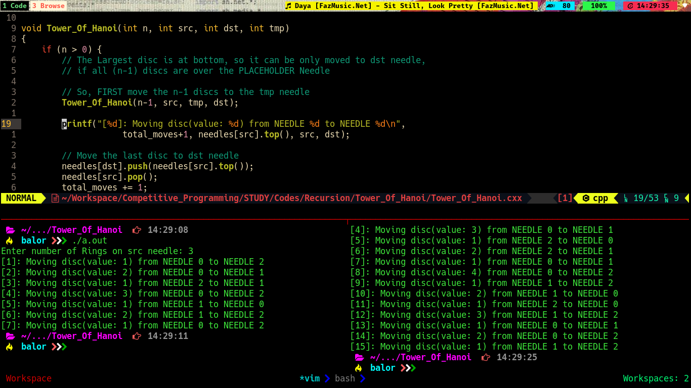

# Recursion

### Tower Of Hanoi
+ Related Links
+ My Approach

###### **Initials / Assumptions**
    I considered the needles/pegs (whatever you call the rods) to be an Array, such that
    Index: 0 (src) -> Rings/Discs are initially placed on this needle
    Index: 1 (tmp) -> A Temporary Place Holder for Rings
    Index: 2 (dst) -> The Destination Needle/Peg for discs

    I also treated each needle/peg as a STACK, as elements could only put on top of it (yeah, only when the item is smaller than that of already over there).

##### **Algorithm**
```
    function Tower_Of_Hanoi(N, src, dst, tmp) {
        if (N > 0) {
            Tower_Of_Hanoi(N-1, src, tmp, dst);

            Remove the TOP of src, and push it onto dst, as all other discs
            are placed on the tmp needle

            Tower_Of_Hanoi(N-1, tmp, dst, src);
        }
    }
```

##### **Complexity Analysis**

We can see from the Algorithm, that
```
    T(n) = 2*T(n-1) + O(1) (assuming push/pop operations to be O(1)) 
```
And, practically, this turns out to be of `O(2^n)`

##### **Code Execution**

